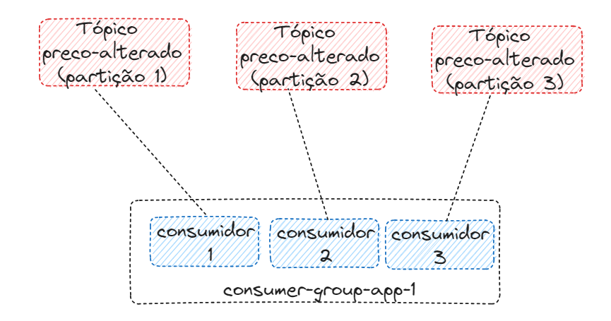

# LAB KAFKA

---
## Disclaimer
> **Esta configuração é puramente para fins de desenvolvimento local e estudos**
> 

---


## Pré-requisitos?
* Docker
* Docker-Compose

---

## Criando o ambiente Kafka com o docker compose


```
docker-compose up -d grafana prometheus jmx-kafka-broker zookeeper kafka-broker zoonavigator akhq
```

Verificando se os containers foram criados com sucesso

```
 docker container ls
```
Verificando as imagens que foram feitas download do docker-hub
```
 docker image ls
```


## O que acontenceu ?


## Acesso WebUI dos componentes


* AKHQ http://localhost:8080/ui
* ZooNavigator http://localhost:8000/
* Prometeus http://localhost:9090/
* jmx-prometheus-exporter http://localhost:5556/
* Grafana http://localhost:3000/login

## Acessos

ZooNavigator

```
zookeeper:2181
```

Grafana

* user : `admin`
* password : `kafka`

---

Vamos executar alguns comandos de dentro do container kafka-broker

Acessar o Shell do container kafka1

```
docker exec -it kafka-broker /bin/bash
```

# Criando nosso Primeiro tópico
```
kafka-topics --bootstrap-server localhost:9092 --topic alunos --create
```

Listando o tópico criado
```
kafka-topics --bootstrap-server localhost:9092 --list 
```

Alguém lembra das partições? Agora o tópico com mais de uma partição

```
kafka-topics --bootstrap-server localhost:9092 --topic alunos-novos --create --partitions 3
```
Esqueceu a configuração do tópico?

```
kafka-topics --bootstrap-server localhost:9092 --topic alunos-novos --describe
```

... e com fator de replicação

```
kafka-topics --bootstrap-server localhost:9092 --topic alunos-novos-factor --create --partitions 3 --replication-factor 2
```
...é não deu certo, porque ?

Agora vai dar certo...
```
kafka-topics --bootstrap-server localhost:9092 --topic alunos-novos-factor --create --partitions 3 --replication-factor 1
```


Criando tópicos com configurações

```
kafka-topics --bootstrap-server localhost:9092 --create --topic topico-config --partitions 3 --replication-factor 1


kafka-configs --bootstrap-server localhost:9092 --entity-type topics --entity-name topico-config --alter --add-config retention.ms=259200000

kafka-topics --bootstrap-server localhost:9092 --describe --topic topico-config

```

# Deletando um tópico

```
kafka-topics --bootstrap-server localhost:9092 --topic alunos-novos-factor --delete
kafka-topics --bootstrap-server localhost:9092 --topic alunos-novos-factor --describe

```

# Produzinho mensagens

```
kafka-console-producer --bootstrap-server localhost:9092 --topic alunos

> Minha primeira mensagem
>Melhor lab do brasil
>Eu sou o Fulano
>^C  (<- Ctrl + C is used to exit the producer)

```

Produzinho mensagens com acks

```
kafka-console-producer --bootstrap-server localhost:9092 --topic alunos --producer-property acks=all
```

Criando o tópico no momento de criar a mensagem

```
kafka-console-producer --bootstrap-server localhost:9092 --topic professor

kafka-topics --bootstrap-server localhost:9092 --topic professor --describe

```

> A Criação do tópico foi possivel pois a propriedade auto.create.topics.enable está com true.

O tópico foi criado com configurações default

Ver as configurações na pasta cat /etc/kafka/server.properties

Produzir mensagens habilitando a Key

```
kafka-console-producer --bootstrap-server localhost:9092 --topic alunos --property parse.key=true --property key.separator=:
>key:value
>aluno:fernando
```

# Consumindo mensagens


```

//Entrando no containar em outro terminal

 docker exec -it kafka-broker /bin/bash

kafka-console-consumer --bootstrap-server localhost:9092 --topic alunos
```


Abre outro terminal, entre no container e produza uma mensagem

```

docker exec -it kafka-broker /bin/bash

//Produzindo mensagens

kafka-console-producer --bootstrap-server localhost:9092 --topic alunos --property parse.key=true --property key.separator=:

>aluno:fernando
>aluno:felipe

```


Consumindo as mensagens desde o inicio


```
>^C  (<- Ctrl + C is used to exit the producer)

kafka-console-consumer --bootstrap-server localhost:9092 --topic alunos --from-beginning

```

Consumindo mensagens mostrado algumas configurações como a key e value

```
kafka-console-consumer --bootstrap-server localhost:9092 --topic alunos --property print.headers=true  --property print.timestamp=true --property print.key=true --property print.value=true --property print.partition=true --from-beginning

>^C  (<- Ctrl + C is used to exit the producer)

```

# Consumer group

Criando um consumer group

Consumindo as mensagens com um consumer group

```
kafka-console-consumer --bootstrap-server localhost:9092 --topic alunos --group aplicacao-lab
```

Em um outro terminal....

Produzindo as mensagem 

```
kafka-console-producer --bootstrap-server localhost:9092  --topic alunos
>nome:fernando
```

Listando os consumer groups em outro terminal

```
docker exec -it kafka-broker /bin/bash
kafka-consumer-groups --bootstrap-server localhost:9092 --list
```

As configurações do consume groups são :

```
kafka-consumer-groups --bootstrap-server localhost:9092 --describe --group aplicacao-lab

```

Resetando os consumer-groups

```
kafka-consumer-groups --bootstrap-server localhost:9092 --group aplicacao-lab --reset-offsets --to-latest  --topic alunos -execute

//--to-earliest                           Reset offsets para o mais antigo.
//--to-latest                             Reset offsets para o mais recente.
//--to-offset <Long: offset>

```


Deletando os consumer groups


```
kafka-consumer-groups --bootstrap-server localhost:9092 --delete --group aplicacao-lab

```

Produzindo mensagem no Round Robin Partitioner

```
kafka-console-producer --bootstrap-server localhost:9092 --producer-property partitioner.class=org.apache.kafka.clients.producer.RoundRobinPartitioner --topic alunos
```
---

## Praticando mais - Desafio




O desafio tera a estrutura da imagem acima:

- Um tópico com nome preco-alterado com 3 partições
- Um consumer group com 3 consumidores


> Crie o tópico com a opção `RoundRobinPartitioner` para simular as mensagens em cada consumidor


# Consumindo mensagens do banco de dados e as replicando


### Realizando download dos plugins Debezium Sql Server (Source) e Mongodb (Sink)


Criando a imagem junto com os plugin o Debezium e Mongodb


```
 docker image build -t <<usuario>>/kafka-connet-debezium-lab-v0  -f Dockerfile .
 
```

Vamos enviar a imagem para o dockerhub ??
https://hub.docker.com/

```
docker image push <<conta>>/kafka-connet-strimzi-debezium-251 
```

> As imagens customizadas encontra-se no https://hub.docker.com/ e na máquina local

Listando os plugins existentes, os que são padrões da imagem, do debezium e o Mongodb que foram inseridos na imagem, via arquivo `Dockerfile`

### Subindo os demais ambientes 

```
docker-compose up -d
```

```
docker exec -it kafkaConect curl  http://localhost:8083/connector-plugins
```

Listando os plugins existente, os defaults da imagem e os debezium que foi inserido na imagem, via Dockerfile

```
docker exec -it kafkaConect curl  http://localhost:8083/connector-plugins
```

### Configurando Banco de dados CDC para SQL

Para esse tutorial vamos utilizar a imagem sql server da Microsoft `mcr.microsoft.com/mssql/server:2019-latest`. Para criar a estrutura dos dados estou utilizando o próprio container criado.

>O arquivo para habilitar CDC e criar o banco de dados, as tabelas e popular com alguns dados está em sql/init.sql que foi executado via Microsoft SQL Server Management Studio ou você pode executar pelo próprio pod conforme código abaixo

Executando os scripts

```
export  SA_PASSWORD=Password!
cat sql/init.sql | docker exec -i sqlserver /opt/mssql-tools/bin/sqlcmd -U sa -P $SA_PASSWORD

```

Criando o conector Sql Server


```
 http PUT http://localhost:8083/connectors/connector-sql/config < conector-sql.json
```

* Observe os arquivos `conector-postgres.json` e `conector-sql.json`

Algumas informações básicas sobre o connector:


* `connector.class`: Nome da classe do conector que está dentro do plugin debezium
* `database.hostname` e `database.port`: endereço IP ou nome de host para sua instância Sql Server, bem como a porta (por exemplo 1433)
* `database.user` e `database.password`: nome de usuário e senha para sua instância Sql Server
* `database.names`: nome do banco de dados
* `database.server.name`: Nome lógico que identifica e fornece um namespace para o servidor / cluster de banco de dados Sql Server específico que está sendo monitorado.


### Testando o Conector

Vamos inserir alguns registros nas tabelas e listar os topicos do Kafka


```
export SA_PASSWORD=Password!

docker exec -i sqlserver /opt/mssql-tools/bin/sqlcmd -U sa -P $SA_PASSWORD -d dbEcommerce -Q "INSERT INTO produtos(nome,descricao, valor, quantidade)  VALUES ('Lapis','lapis de escrever', 1.99, 2);"


```

Listando os tópicos


```
docker exec -it kafka-broker /bin/bash
kafka-topics --bootstrap-server localhost:9092 --list 
```

*Consumindo mensagem sqldebezium.dbo.produtos - Datasource SQL Server*


```
kafka-console-consumer --bootstrap-server localhost:9092 --topic server2.dbEcommerce.dbo.produtos --from-beginning
```

*Consumindo mensagem e publicando mensagens via aplicação 


# Remover os containers

```
exit
docker-compose down
```
